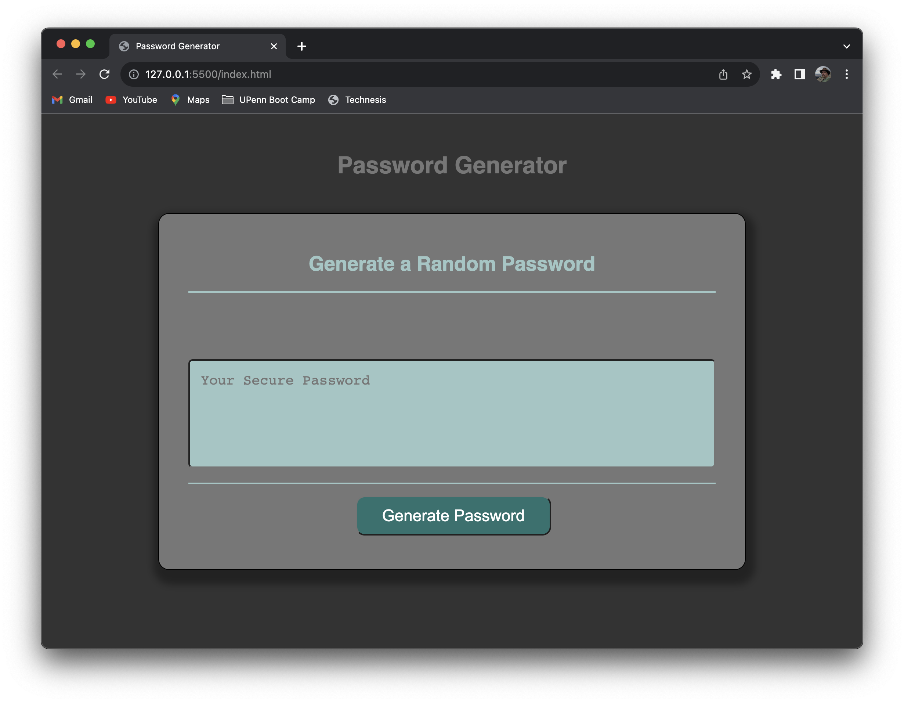
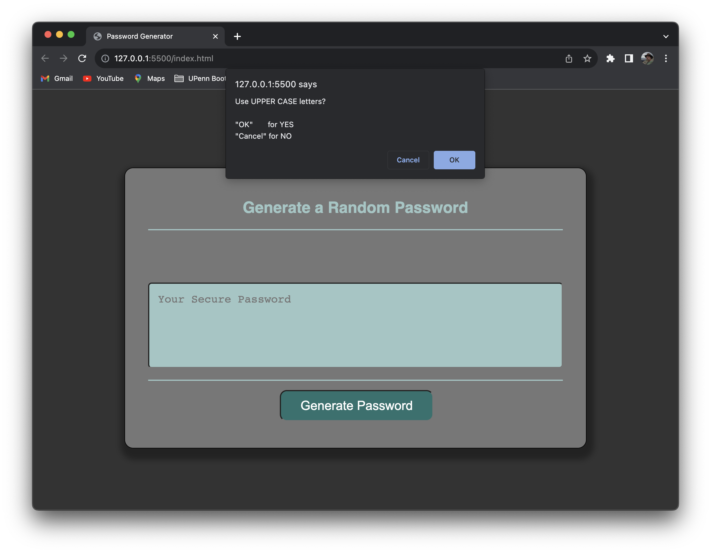
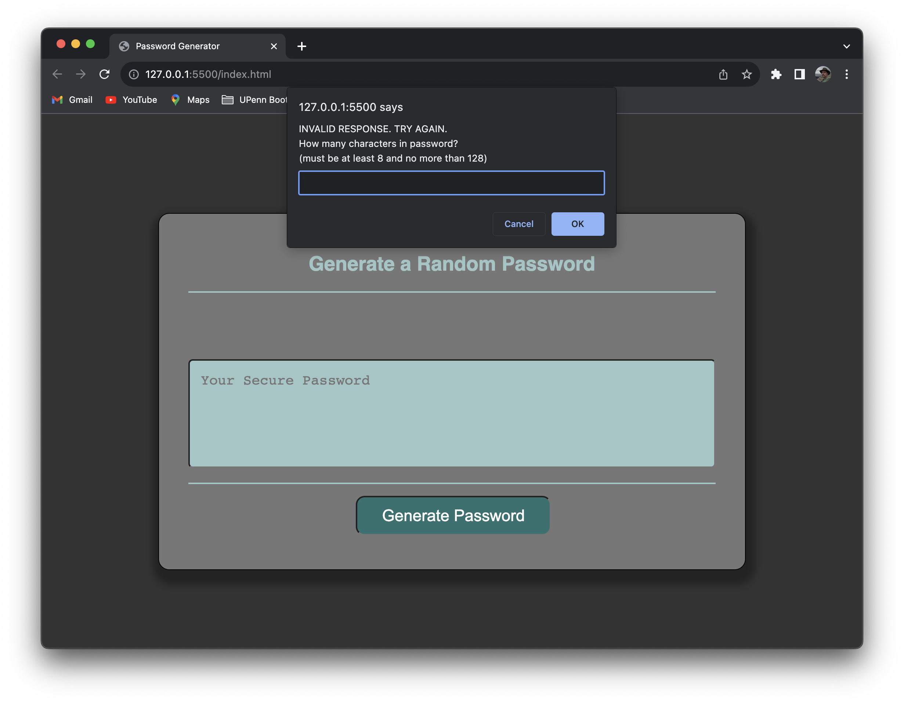
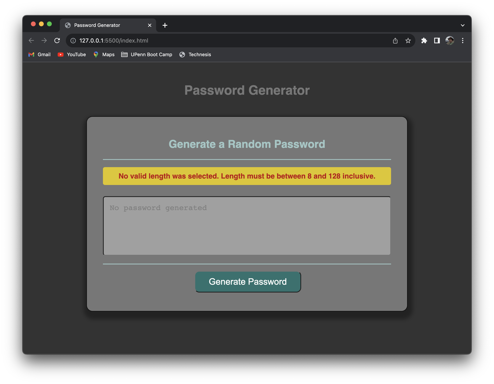

# Password Generator

## Description

A project whose goal is to create a javascript-driven generator of random passwords.  

- Key features of the resulting HTML/CSS/Javascript site are:
    - User can opt in or out of any of the following sets of characters:
        - Upper case letters
        - Lower case letters
        - Decimal numbers
        - Special characters
    - User can specify the desired length of the password to be generated
        - Validation is done to insure numeric content
        - Validation is done to insure the requested length of password is within allowed range (8 to 128)
    - Failures in validation, whether for invalid length or because none of the types of characters were selected, result in brightly colored alert in the page content.
    - The password is displayed in a textarea whose background color is dynamically dimmed.
        - This feature is designed to make the password gradually less easily visible of the pages is left unattended and on display.
        - This feature is enabled via Javascript setInterval().
        - The original level of contrast is restored by any mouse movement over the password display area.

- In completing this project, the following have been learned:
    - Use of some advanced style techniques in CSS
    - Javascript, including but not limited to:
        - dynamic alteration of page content
        - event listeners
        - timed loop execution via setInterval() and clearInterval() functions
        - disabling the "Generate Password" button while the user dialog and password calculation is executing

## Table of Contents

- [Usage](#usage)
- [Credits](#credits)
- [License](#license)

## Installation

For users of the this page, there is no installation needed beyond having a browser.  (see [Usage](#usage))

For developers, installation requires:
- Access to GitHub repository [github.com/stevreut/js-password-generator](https://github.com/stevreut/js-password-generator) 
- Appropriate tools for editing, testing, and deploying component modules.

## Usage

The result of this project is a web site accessible via web browser at [stevreut.github.io/js-password-generator/](https://stevreut.github.io/js-password-generator/) .  No installation is required beyond that for use.

Resulting web presentation should resemble the following:

## Credits

Special thanks to the teaching staff of the University of Pennsylvania Full Stack Coding Boot Camp (UPENN-VIRT-FSF-FT-07-2023-U-LOLC-M-F).

Innumerable publicly available reference resources were consulted in pursuing this project.

## License

As of this date (27 July 2023), no licensing policy has been established for this project or its repository.
